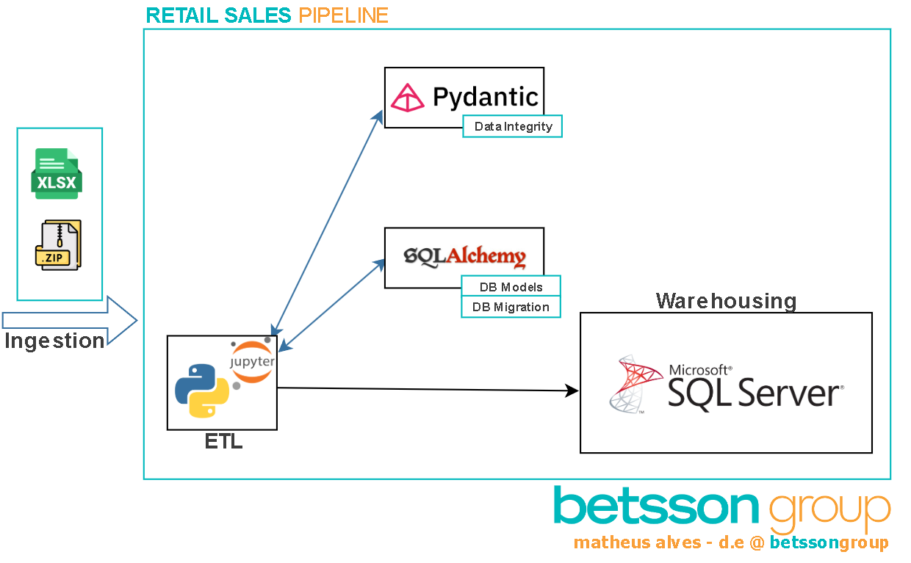
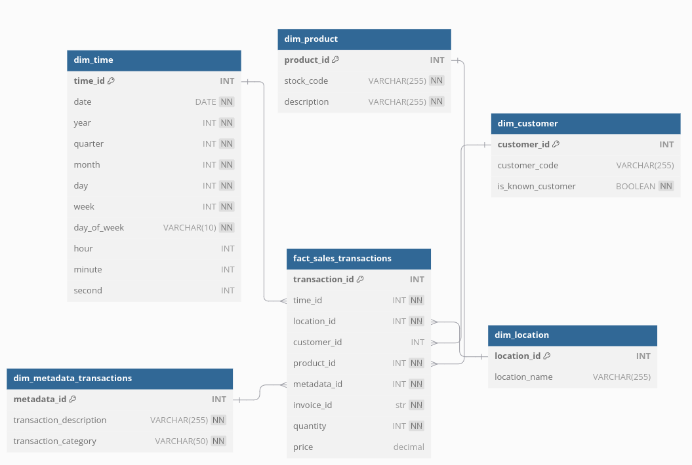
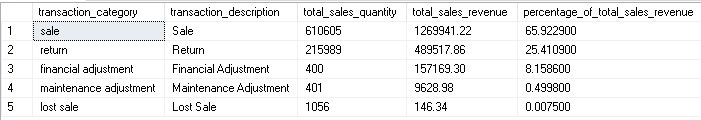
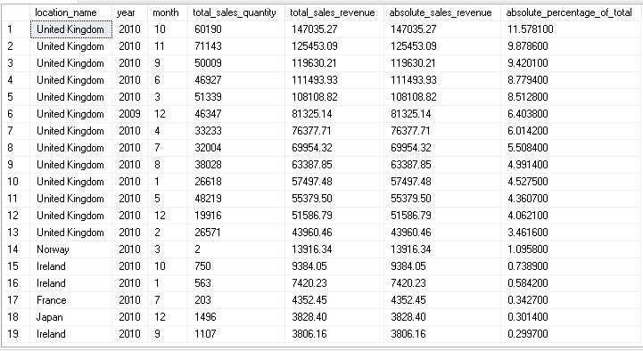

<h1 align="center">
  <b>Data Engineering Assessment - Matheus Alves</b>
</h1>

<p align="center">
  
  
  
  
  
  
</p>


## The Challenge

1. **By making use of the `invoices.xls` data file as your source, create a Data Warehouse model with best practices in place, using the Kimball methodology.**
2. **Populate the model created in step 1 with the data provided in the Excel sheet.**
3. **Analyze any abnormalities (if any) in the data provided and take any action needed (where possible).**
4. **List any assumptions taken into consideration.**
5. **Provide 3 different aggregations one might use for reporting purposes.**  

<br>
<br>

<p align="center">
  
</p>

<br>


## Table of Contents

- [0. Base Constraints](#0-base-constraints)
- [0.1. Scope Matrix - Documentation and Code](#01-scope-matrix---documentation-and-code)
  - [0.1.1 Base General Process](#base-general-process)
  - [0.1.2 Base ETL Considerations](#base-etl-considerations)
  - [0.1.3 Base Warehouse Considerations](#base-warehouse-considerations)
- [1. Assumptions & Abnormalities](#1-assumptions--abnormalities)
  - [1.1 Base Considerations](#11-base-considerations)
  - [1.2 Overall Data Assumptions](#12-overall-data-assumptions)
  - [1.3 Overall Data Abnormalities](#13-overall-data-abnormalities)
  - [1.3.1 Country column](#131-country-column)
  - [1.3.2 Customer ID column](#132-customer-id-column)
  - [1.3.3 Price column](#133-price-column)
  - [1.3.4 Quantity column](#134-quantity-column)
  - [1.3.5 Description column](#135-description-column)
  - [1.3.6 StockCode column](#136-stockcode-column)
  - [1.3.7 General columns data](#137-general-columns-data)
- [2. Pipeline Architecture Diagram](#2-pipeline-architecture-diagram)
- [2.1 Data Warehouse Schema Diagram](#21-data-warehouse-schema-diagram)
- [2.2 Documentation](#22-documentation)
  - [Tables and Columns](#tables-and-columns)
- [3. Packages and modules overview](#3-packages-and-modules-overview)
  - [3.0. Running the project](#30-running-the-project) 
  - [3.1. Main Script](#31-main-script)
  - [3.2. infra](#32-infra)
  - [3.3. ingestion](#33-ingestion)
  - [3.4. utils](#34-utils)
  - [3.5. assets](#35-assets)
- [4. General Code Structure](#4-general-code-structure)
- [Aggregations & Reporting](#aggregations--reporting)
  - [1. Insight - (AVTQ) Absolute Value of Transaction Quantities and Revenues across different categories](#1-insight---avtq-absolute-value-of-transaction-quantities-and-revenues-across-different-categories)
  - [2. Insight - (SLICR) Sales Location Impact Comparison on Revenue](#2-insight---slicr-sales-location-impact-comparison-on-revenue)
  - [4. Data-Driven Deep](#4-data-driven-deep)
- [Tunning Scenario](#tunning-scenario)

---

## 0. Base Constraints

- This task may be done either with MSSQL, Python or C#.

- It is highly recommended that comments are included, and code is structured well.

- If making use of python, you can make use of Jupyter notebooks, thus you can either

- provide a .PY file or .IPYNB file.

- Assumptions & Abnormalities are to be provided in a separate document.

<br>
<br>

## 0.1 Scope Matrix - Documentation and Code


### Base General Process
| Feature                                          | In Scope (MVP) | Out of Scope |
|--------------------------------------------------|----------------|--------------|
| README.md-based documentation (iterative view)  | ✅             |              |
| PDF documentation (static)                      | ✅             |              |
| Module and package details                      | ✅             |              |
| Base real case assumptions                      | ✅             |              |
| Packages and modules partially/fully reusable   | ✅             |            |
| Base data quality check                         | ✅             |            |
| Cloud-related environments                      |                | ✅           |
| Full production-ready                           |                | ✅           |
| Non-Python frameworks for ETL                   |                | ✅           |
| Specific metrics logging (to be used in Prometheus, for instance)           |                | ✅           |
| Deeply statistic approaches in warehouse/data cleaning           |                | ✅           |
| Specific Architecture Consumption/Tunning Scenario|| ✅           |

### Base ETL Considerations
| Feature                                          | In Scope (MVP) | Out of Scope |
|--------------------------------------------------|----------------|--------------|
| Process diagrams                                | ✅             |              |
| Isolated environment (.venv, optional)          | ✅             |              |
| `pip` requirements (`pip install -r requirements_xx.txt`) | ✅  |              |
| APIs                                            |                | ✅           |
| Scheduler-ready                                 |                | ✅           |

### Base Warehouse Considerations
| Feature                                          | In Scope (MVP) | Out of Scope |
|--------------------------------------------------|----------------|--------------|
| Data full metadata                              | ✅             |              |
| Client basic tuning example (MSSQL Query Plan)  | ✅             |              |
| Decision explained                              | ✅             |              |
| Physical computing/database architecture and setup |              | ✅           |
| Server basic tuning (on possible queries)       |                | ✅           |

<br>
<br>

## 1. Assumptions & Abnormalities

### 1.1 Base Considerations

There are two main logic on this assesment answers.
  - **draw.ipynb (Jupyter Notebook):** Containing draws.
  - **solution.py (Script):** Pipeline solution.
Consideration:
  - Assumptions usually are discussed with the areas/teams involved. In a real-world scenario, I would discuss these assumptions with the business team to ensure that they are aligned with the business rules and requirements.
    - **This consideration applies to every main assumption I make.**
 
 - This code is made on python + mssql.
  - New data overwrite old data.
<br>
<br>

---

#### 1.2 Overall Data Assumptions
- I'm assuming that the data is a snapshot and we don't need to update it in the database.
- Data snapshot only; no updates required.
  - Even with that in mind, we have dimensions, for instance, that take into consideration Slowly Changing Dimensions (SCD) Type 2, to keep track of the changes in the data.

- Lowercase will be used for column names, in addition to snake case.
  - This is a common practice to avoid any possible issues with the database.

- Adjust data.
  - Maintaned and flagged, proper differenciated from sales.
    - adjustments can address wastes in Lean Methodologies as well potential losses by possible mistakes, and can come to be explored.
- I am assuming that every valid product adjustment at any category is being properly identificate in the description column.
- I am assuming that every known retail is registered, and related transactions share the same ID across different lines.

- I am assuming that I am dealing with hybrid store sales. That sails are made both online and offline.

- A simple solution to mapped values is to use a dictionary to standardize the values.
    - More complex cases involving large datasets, approaches can range from using a Cartesian mapping stored in a .txt file to developing a classification model to identify and standardize variations in location names automatically.

- No special cases in invoice date column.

- Warehouse inserted data was also approached with null scenarios. They were ignored, as they was threated as special cases. I'm assume I've maitaned referencial integrity.

#### 1.3 Overall Data Abnormalities
- Columns contain missing values that can represent various scenarios, ranging from errors/bugs to information that was not shared.
  - I am categorizing these values appropriately.
  - Unspecified: Explicitly chose not to declare their information.
  - Null (e.g., None, NaN): Did not provide the information at all.

- I am assuming this governance rule (when I have not specified a different approach):
  - Placeholder values will be standardized as "Unspecified."
  - Null values will remain as null.

- There were test values that have been addressed and removed from all columns.
  - I am assuming that there are no special cases, such as identifying errors in the client flow that need to be registered.

- To effectively address description and category problems, I would evaluate the possibility of creating a governance policy to map such cases according to the business rules.
  - I'm assuming that this scenario involves areas where I am unable to act.

##### 1.3.1 Country column

- Some entries in the Country column might not represent valid country names (e.g., typos, placeholders, or regions like "Channel Islands").
  - The simplest approach would rename Country to Locations.

- Some entries in the Country column are abbreviated, such as "United Kingdom" and "UK".

##### 1.3.2 Customer ID column
- Test customers identified, when casually understanding data format.
  - There is 'test' data on different columns.
- Null clients often relates (based on description column) to manual inserts, fee, a/b testing. I'll deal with them in the following lines.
- Sales that doesn't have a description, as well doesn't have a customer ID, will be flagged as special cases.
- I'm assuming that customer id and description missing, being < 0, are error entries. 

##### 1.3.3 Price column
- Prices equals to zero or negatives.
  - There were unusual descriptions such as "mixed" and "short". They are ignored, as they are relevant sales.
  - I will map returns and consider them valid only when Quantity_return is less than Quantity_sale (based on merging invoice and StockCode data, validating negative values against all related entries).

- Values involving different scenarios.
  - Damages, damaged, bad quality.
  - Damages or negative descriptions appoitnments at any kind will be flagged as lost sales.
    - Descriptions that are not clear or relevant, such as 'lost in space,' will be flagged as lost sales. I will assume these represent some kind of product damage or loss.
    - I am also assuming that there are no valid descriptions that share the same part of their definition. For instance, terms like "wet" in descriptions such as 'WET PLANT PERFECTLY DECORED' are not being used ambiguously.
    - I'm usinng a list of known descriptions patterns to flag lost sales.

##### 1.3.4 Quantity column
- Negative and zero values that isn't some returned data.
  - Some negative data refers to discounts. They are flagged as discount.
- There where match in stockcode agains't null values.
For rows without a Description or Price, I am assuming the last recorded Description and Price based on the StockCode. This assumes that StockCode descriptions are static, and the last recorded value is correct and applicable

##### 1.3.5 Description column
- There are ids on description, that seems to be a stockcode, but there aren't any indicator. I'm assuming that they are 
- AMAZON FEE, adjustments in bad debt, etc, they will be flagged as financial detail.
- Adjustments are flagged as maintenance data.
  - Only adjustments proper described will be flagged as maintenance data.
- Update are flagged as maintenance data.
- Bargains are discounts, but they are threat directly as financial detail.

##### 1.3.6 StockCode column
- There is patterns in stockcode like "M", "D". Coming exclusively, they are representating discount. Manual sales are sales as the others, they are ignored.
- Discounts are flagged as discount.
- Stock code S, representing samples, typically has values of -1. However, there are some cases where this is not the case. These will be flagged to be removed.
- Gift are flagged as lost sales
- Test are flagged to be removed.
- Stockode flagged on DW when.
  without return flag or quantity < 0.
- Bankcharges are flagged as financial detail.

##### 1.3.7 General columns data

- Guarantee that overall mapped appointment is being properly flagged.
- After filtering all flagged columns, any remaining abnormal data is reviewed.
- I've tried to enrich data, but there were no match:
  - Price: Updated using the most recent value for the same stock_code.
  - Description: Updated using the modal (most frequent) value for the same stock_code.
  - Assuming that if resulting value is null and there is no client id, so it is entry error.
<br>
<br>

---
## 2. Pipeline Architecture Diagram

<p align="center">
  
</p>


## 2.1 Data Warehouse Schema Diagram
<p align="center">
  
</p>

## 2.2 Documentation

### Tables and Columns

#### `dim_time`
| Column        | Description                                                                 |
|---------------|-----------------------------------------------------------------------------|
| `time_id`     | Primary key for the time dimension.                                         |
| `date`        | The full date in `YYYY-MM-DD` format.                                       |
| `year`        | The year of the transaction.                                               |
| `quarter`     | The quarter of the year (1-4).                                             |
| `month`       | The month of the year (1-12).                                              |
| `day`         | The day of the month (1-31).                                               |
| `week`        | The week of the year (1-53).                                               |
| `day_of_week` | The name of the day (e.g., "Monday").                                       |
| `hour`        | The hour of the transaction (0-23, optional).                              |
| `minute`      | The minute of the transaction (0-59, optional).                            |
| `second`      | The second of the transaction (0-59, optional).                            |

---

#### `dim_location`
| Column          | Description                                                              |
|------------------|--------------------------------------------------------------------------|
| `location_id`    | Primary key for the location dimension.                                  |
| `location_name`  | The name of the location where the transaction occurred.                |

---

#### `dim_customer`
| Column             | Description                                                          |
|---------------------|----------------------------------------------------------------------|
| `customer_id`       | Primary key for the customer dimension.                              |
| `customer_code`     | Unique code identifying the customer, if available.                 |
| `is_known_customer` | Indicates whether the customer is known (`True`) or anonymous (`False`). |

---

#### `dim_product`
| Column         | Description                                                              |
|-----------------|--------------------------------------------------------------------------|
| `product_id`    | Primary key for the product dimension.                                   |
| `stock_code`    | Unique code identifying the product stock.                               |
| `description`   | Description of the product.                                             |

---

#### `dim_metadata_transactions`
| Column                   | Description                                                    |
|---------------------------|----------------------------------------------------------------|
| `metadata_id`             | Primary key for the metadata transactions table.              |
| `transaction_description` | Description of the transaction type or reason.                |
| `transaction_category`    | Category of the transaction (e.g., "sale", "return", "adjustment", "fee"). |

---

#### `fact_sales_transactions`
| Column         | Description                                                              |
|-----------------|--------------------------------------------------------------------------|
| `transaction_id`| Primary key for the fact table.                                           |
| `time_id`       | Foreign key referencing `dim_time`.                                      |
| `location_id`   | Foreign key referencing `dim_location`.                                  |
| `customer_id`   | Foreign key referencing `dim_customer`.                                  |
| `product_id`    | Foreign key referencing `dim_product`.                                   |
| `metadata_id`   | Foreign key referencing `dim_metadata_transactions`.                    |
| `invoice_id`    | Unique identifier for the invoice.                                       |
| `quantity`      | Number of units involved in the transaction (can be negative for returns). |
| `price`         | Price per unit of the product (nullable; may include refunds or adjustments). |

<br>
<br>

---
## 3. Packages and modules overview

### 3.0. Running the project

- **Requirements**: Python 3.9+ and Jupyter Notebook.
- **Use a virtual environment**: `python -m venv .venv`
- **Installation**: Run `pip install -r requirements_xxx.txt`. The requirements file includes two sets of dependencies: one specifically for the Jupyter Notebook (.ipynb) and another for the Python-based script. This separation ensures that the notebook's additional dependencies are only installed if you plan to use it, keeping the main script lightweight and efficient.
- **Create and fill a file called '.env' in the root directory of this project. Fill it with the following environment variables**:
  ```bash
    MSSQL_WAREHOUSE_URL="mssql+pyodbc://<username>:<password>@<host>/<database>?driver=ODBC+Driver+17+for+SQL+Server&trusted_connection=yes"
  ```
- **Run the main script**: `python solution.py` on your terminal, from the root project diretory.

### 3.1. Main Script
- **`solution.ipynb`**: Straightforward End-to-End Approach to Address the Challenge
- **`main_adjusted_retail_analysis.py`**: Example of a dedicated pipeline, including all modules. Lineage tracker ready, with space to implement a run back from stopped stage.

### 3.2. infra
- models
  - Dimensional and fact models.
    - `dim.py` - all dimensional to our DW models.
    - `fact.py` - all fact to our DW models.

- pipeline
  - Pipeline specif codes
    - `pipeline_metadata.py` - References to metadata process. Like Mapping, etc.
        - NORMATIZE_LOCATION_MAP - a dict containing the mapping of normalized location names.
        - CLOUD_LOST_PRODUCTS_WORDS - a list of words that indicate lost products.
        - STAGE_III_COLUMNS - renamed columns to be used in the pipeline.
        - validation_models - mapper containing Pydantic models to validate the data.
        - models_map - mapper containing sqlalchemy models to validate the data.

    - `pipeline_lineage.py` - It stores stages related to the pipeline.
      - get_csv_df - Reads CSV files into pandas DataFrame format.
      - PipelineTransformer - BR Contains every stage and their transformations, as well as a saving method.
    - `pipeline_transformers.py` - Business rules (BR) and general transformations (GR) to be used on the pipeline.
      - sanitize_column_data - BR related to fill null data and format types.
      - sanitize_text - BR related to sanitize text data. It will remove special characters, and replace accented characters with their unaccented counterparts.
      - BaseTableGenerator - BR related to generate base tables.
      - DimTimeGenerator - BR related to generate the time dimension.
      - DimLocationGenerator - BR related to generate the location dimension.
      - DimCustomerGenerator - BR related to generate the customer dimension.
      - DimProductGenerator - BR related to generate the product dimension.
      - DimMetadataTransactionsGenerator - BR related to generate the metadata transactions dimension.
      - FactSalesTransactionsGenerator - BR related to generate the sales transactions fact table.
      - generate_warehouse_sales_tables - GR related to generate the warehouse tables.
      - validate_warehouse_sales_data - BR related to validate the warehouse tables.
      - validate_data_integrity - BR related to validate the data integrity.

- handlers
  - General handlers for database related and data processing.
    - `db_migration_handler.py` - Alembic migration handler. It is supposed to run once, and it will create the database and tables. As well with the possible indexes, based on the warehouse models.
    - `msql_handler.py` - MSSQL connection handler. It will be used to return the connection engine to be orchestrated by sqlalchemy/alembic/direct-queries.


### 3.3. ingestion
- Ingested data as 7z.
- Extracted data as csv/xls.

### 3.4. utils
- `_references.py` - base code references, like logging, etc.
  - get_current_utc_time - datetime now in UTC time.
  - create_logger - created supposed to use as unique logger for the application.
- `file_handlers.py` - utilities to write/read/process/format files.
  - extract_7z - It will extract the 7z file to a folder. This one is our "imaginary API".

### 3.5. assets
- Images and other assets used on README.md and other documentation.
It doesn't make part of the codebase.

<br>
<br>

---

## 4. General Code Structure

- Load the data.
- Understand data scenario.
- Avoided generic changes to the data on the beginning.
- Created specific changes to the data per column.
  - Revisit different columns while exploring possible business rules.
- Transformate specific columns.
- Quick overview of transformations.
- Check data as a whole, after specific transformation.
- Apply generic changes on data.
- Validate transformations.
- Generates warehouse transformations.
- Validate warehouse transformations.
- Save data.

Code can include intermediate passes like "saving stages".


## Aggregations & Reporting

**I'm considering that the data is accurate enough (based on assumed prior reviews), and these represent real insights.**


### Aggregations.sql

#### 1. Insight - (AVTQ): Absolute Value of Transaction Quantities and Revenues across different categories.

Magnitude of operational activity within each transaction category, without distinguishing between income and expense.

```sql
WITH category_totals AS (
    SELECT
        m.transaction_category,
        m.transaction_description,
        SUM(ABS(f.quantity)) AS total_sales_quantity,
        SUM(ABS(f.quantity * f.price)) AS total_sales_revenue
    FROM master.sales_warehousing.fact_sales_transactions AS f
    INNER JOIN master.sales_warehousing.dim_metadata_transactions AS m
        ON f.metadata_id = m.metadata_id
    GROUP BY
        m.transaction_category,
        m.transaction_description
),
grand_total AS (
    SELECT
        SUM(ct.total_sales_revenue) AS grand_total_sales_revenue
    FROM category_totals AS ct
)
SELECT
    ct.transaction_category,
    ct.transaction_description,
    ct.total_sales_quantity,
    ct.total_sales_revenue,
    (ct.total_sales_revenue / gt.grand_total_sales_revenue) * 100 AS percentage_of_total_sales_revenue
FROM category_totals AS ct
CROSS JOIN grand_total AS gt
ORDER BY
    percentage_of_total_sales_revenue DESC;
```

<div style="display: flex; align-items: center; justify-content: center;">
  <p style="max-width: 400px; margin-right: 20px;">
    This visualization demonstrates the Absolute Volume and Quantity Transaction (AVQT) analysis results.
    This scenario highlights offenders like product returns, generating insights into how
    we could approach reducing the return rate by, for instance, 80%, focusing on the top 20% reasons.
    Strategies might include gathering customer feedback, understanding reasons for returns, and so on.
    Product quality checks, customer service improvements, and other strategies could be implemented.
  </p>
  
</div>

<br>

#### 2. Insight - (SLICR): Sales Location Impact Comparison on Revenue
Monthly contribution of sales transactions by location, expressed as a percentage of the total absolute revenue for all sales transactions.
A transaction is a sale when transaction_category = 'sale'.

```sql
WITH location_sales AS (
    SELECT
        l.location_name,
        t.year,
        t.month,
        SUM(f.quantity) AS total_sales_quantity,
        SUM(f.quantity * f.price) AS total_sales_revenue
    FROM master.sales_warehousing.fact_sales_transactions AS f
    INNER JOIN master.sales_warehousing.dim_location AS l
        ON f.location_id = l.location_id
    INNER JOIN master.sales_warehousing.dim_time AS t
        ON f.time_id = t.time_id
    INNER JOIN master.sales_warehousing.dim_metadata_transactions AS m
        ON f.metadata_id = m.metadata_id
    WHERE m.transaction_category = 'sale'
    GROUP BY
        l.location_name, t.year, t.month
),
total_revenue AS (
    SELECT
        SUM(ABS(total_sales_revenue)) AS absolute_total_revenue
    FROM location_sales
)
SELECT
    ls.location_name,
    ls.year,
    ls.month,
    ls.total_sales_quantity,
    ls.total_sales_revenue,
    ABS(ls.total_sales_revenue) AS absolute_sales_revenue,
    (ABS(ls.total_sales_revenue) / tr.absolute_total_revenue) * 100 AS absolute_percentage_of_total
FROM location_sales AS ls
CROSS JOIN total_revenue AS tr
ORDER BY
    absolute_percentage_of_total DESC,
    ls.year DESC,
    ls.month DESC;
```

<div style="display: flex; align-items: center; justify-content: center;">
  <p style="max-width: 400px; margin-right: 20px;">
    This visualization demonstrates the (SLICR): Sales Location Impact Comparison on Revenue analysis results.
    This scenario highlights locations with a higher percentage of sales revenue. Based on these insights, we can create targeted promotions and enhance marketing strategies in strong locations while identifying opportunities to explore untapped potential in weaker locations.
    A solid approach would involve analyzing the factors contributing to the performance of both strong and weak locations, followed by implementing appropriate campaigns and lead generation strategies.
  </p>
  
</div>


<br>
<br>

### 4. Data-Driven Deep
- Our approaches are determined by business rules and the data we have available. These factors also shape the reports we aim to generate and follow.
- The first insight provides a general overview of what happened in the specific date range. From there, we could adopt monthly approaches to better understand the seasonality of this pain point. By offering the best services to our clients, we can also gain deeper insights into how to remain truly competitive.
- The second insight provides a more detailed view of the data, focusing on the location impact on revenue. This approach could be used to identify the best locations to invest in, as well as the locations that need more attention. Monitoring and properly acting, we avoid weaking strong locations.

*In data we trust*

<br>
<br>

---
### Tunning Scenario
*This will not be performed, but I'm assuming that I would use these aggregations to create reports for the business team. Here would be my approach for also tuning this scenario.*

*This is a first basic approach. I'm assuming that there aren't logs yet (which could help identify most used columns, for instance).*

- Tuning approach, client side:
  - Query leveraging predicate filters.
  - Understand the Logical plan by the optimizer:
    - Identify bottlenecks in the execution plan by the optimizer.
    - How could I induce the optimizer to better optimize the query plan?
  - Understanding query optimal scenario tuning.
  - Understanding query hints.

Now, after having the execution plan and a proposed scenario, I can proceed to basic server-side tuning (assuming we are on a hybrid ecossystem).

- Indexes: They need special considerations—the trade-off between maintenance and performance.
Understand base columns to be indexed
  - Understand base columns to be indexed
- Statistics: They are crucial to the optimizer. There is no logical in having indexes without updated statistics.
  - Governance to set frequent statistics updates.
- Partitioning, if necessary.
- Cost Threshold, parallelism, and other high-level  server configurations.

We would need approaches like governance, to ensure optimal database performance. Consumption governance (help with querie base good practices). Among others.


---
*Matheus Alves. @ 2024*